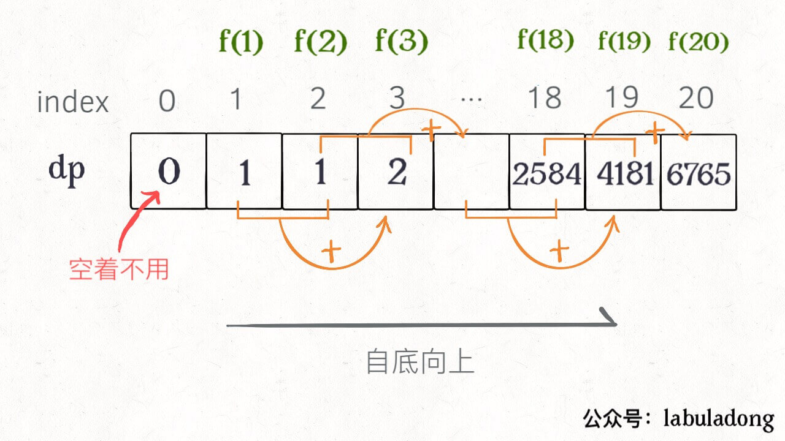

# 动态规划

动态规划（Dynamic programming）简称 DP，通过把原问题分解为相对简单的子问题的方式来求解复杂问题。

动态规划用于查找有很多重叠子问题的情况的最优解。它将问题重新组合成子问题。为了避免多次解决这些子问题，它的结果都逐渐被计算并保存，从简单的问题直到整个问题都被解决。

下面我们通过一个例子来理解动态规划的核心思想。

### 自顶向下的递归

Q：求解斐波那契数列中索引为 n 的值。

我们可以使用递归来求解：

```swift
func fibonacciNumber(_ index: Int) -> Int {
    if index == 0 { return 0 }
    if index == 1 { return 1 }
    return fibonacciNumber(index - 1) + fibonacciNumber(index - 2)
}
```

看起来没有毛病，但是这种方案其实效率很低，让我们来分析一下实际运算过程中发生了什么。

假设 n = 20，画出递归树：


> PS：但凡遇到需要递归的问题，最好都画出递归树，这对你分析算法的复杂度，寻找算法低效的原因都有巨大帮助。

可以看到这种解法的时间复杂度是 O(2^n)。

对递归树进行分析可知，算法中存在大量的重复运算。

因此我们可以对这些重复运算的结果进行缓存，需要的时候直接读取。

```swift
var cacheArray: [Int] = [0, 1]

func fibonacciNumber(_ index: Int) -> Int {
    if index == 0 { return 0 }
    if index == 1 { return 1 }
    
    cacheArray = Array(repeating: 0, count: index + 1)
    if cacheArray[index] != 0 { return cacheArray[index] }
    cacheArray[index] = fibonacciNumber(index - 1) + fibonacciNumber(index - 2)
    return cacheArray[index]
}
```

这样我们就实现了对重复计算的的剪枝。


此时时间复杂度为 O(n)，空间复杂度为 O(n)。

这就是动态规划的核心：**将复杂问题分解为许多简单问题，对简单问题的结果进行缓存，以提高求解效率，最终求解出整体答案。**

有了上面的基础，我们完全可以从最小子问题一步一步向上求解得到最终结果。

### 自底向上的迭代

使用迭代的方式进行求解。

```swift
func fibonacciNumber(_ index: Int) -> Int {
    var cacheArray = Array(repeating: 0, count: index + 1)
    cacheArray[0] = 0
    cacheArray[1] = 1
    
    for i in 2...index {
        cacheArray[i] = cacheArray[i - 1] + cacheArray[i - 2]
    }
    return cacheArray[index]
}
```




参考链接：

- [维基百科：动态规划](https://zh.wikipedia.org/wiki/%E5%8A%A8%E6%80%81%E8%A7%84%E5%88%92)
- [https://labuladong.gitbook.io/algo/dong-tai-gui-hua-xi-lie/dong-tai-gui-hua-xiang-jie-jin-jie](https://labuladong.gitbook.io/algo/dong-tai-gui-hua-xi-lie/dong-tai-gui-hua-xiang-jie-jin-jie)