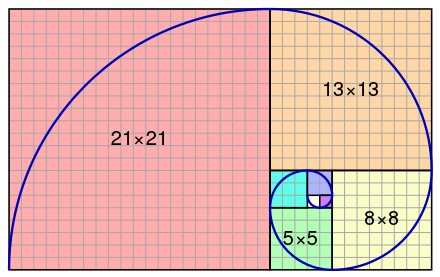
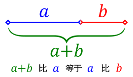

# 常见的查找算法

常见的查找算法有：

- 线性查找（顺序查找）
- 二分查找
- 插值查找
- 斐波那契查找
- 树查找
- 分块查找
- 哈希查找

### 线性查找

线性查找（Linear search）又称顺序查找。指按一定的顺序检查数组中每一个元素，直到找到所要寻找的特定值为止。是最简单的一种搜索算法。

线性搜索的时间复杂度是 O(n)。

**实现过程**

实现了 Equatable 协议的元素：

```swift
func linearSearch<T: Equatable>(_ array: [T], _ object: T) -> Int {
  for (index, obj) in array.enumerated() where obj == object {
    return index
  }
  return -1
}
```

根据条件，进行比较：

```swift
func linearSearch<T>(_ array: [T], _ condition: (T)-> Bool) -> Int {
    for (index, obj) in array.enumerated() where condition(obj) {
        return index
    }
    return -1
}
```

### 二分查找

二分查找（Binary search）又称折半查找，用于**有序**数组。

时间复杂度为 O(log n)。 

**实现过程**

假设待搜索数组是有小到大排列的。

将目标值与中位元素比较。

- 如果等于中位元素则返回；
- 如果小于中位元素就继续取前半部分的中位元素进行比较；
- 如果大于中位元素就继续取后半部分的中位元素进行比较。

就这样递归直到某一步数组为空，说明没有找到目标值。

**实现代码**

通常，因为递归需要调用很多层函数，所以将其转换成迭代可以将效率提高。

下面是迭代版本的实现过程：

```swift
func binarySearch<T: Comparable>(_ array: [T], key: T) -> Int {
    var low = 0
    var high = array.count
    while low < high {
        let mid = low + (high - low) / 2
        if array[mid] == key {
            return mid
        } else if array[mid] < key {
            low = mid + 1
        } else {
            high = mid
        }
    }
    return -1
}
```

### 插值查找

插值查找是二分查找的改进版本。

对于数组较大，关键字分布比较均匀，插值查找性能比二分查找性能好得多。

> 为什么每次要折半而不是折四分之一或者更多呢？打个比方，在英文词典里查“apple”，你会下意识翻开前面的书页，而如果你要查“zoo”，很显然，你肯定不会从中间开始查起，而是有一定目的地往后翻。同样地，比如在取值范围 0-10000 之间100个元素从小到大均匀分布的数组中查找 5 ，我们自然会考虑从数组角标较小的开始查找。《大话数据结构》

插值公式：

```swift
mid = low + (key - array[low])/(array[high] - array[low]) * (high - low)
```

**实现过程**

```swift
func interpolationSearch(_ array: [Int], key: Int) -> Int {
    var low = 0
    var high = array.count - 1
    while low < high {
        let mid = low + (key - array[low])/(array[high] - array[low]) * (high - low)
        guard low <= mid && mid <= high else { break }
        if array[mid] == key {
            return mid
        } else if array[mid] < key {
            low = mid + 1
        } else {
            high = mid
        }
    }
    return -1
}
```

### 斐波那契查找

斐波那契查找（Fibonacci Search）也是在二分查找基础上扩展而来的。

**斐波那契数列**

F(0) = 0

F(1) = 1

F(n) = F(n - 1) + F(n - 2) 

这里 n > 1

可以看到斐波那契数列满足如下特征：从第2项开始，每个数都等于前两个数之和。

0, 1, 1, 2, 3, 5, 8, 13, 21, 34, 55, 89, 144, ...

> 在一些比较老的书籍中，F(0) = 0 被缺省了。



斐波那契数列跟**黄金分割**联系非常密切：在斐波那契数列中，F(n)/F(n - 1) 的值随着 n 值增加，会越来越逼近黄金分割 1.680339887498... 。



斐波那契查找正是以此为优化依据的。


**查找过程**

设 n 为待搜索数组的长度，如果 n 不是斐波那契数列 F 中的元素，就将数组扩容到F(m)，F(m) 是 F 中大于 n 的最小值。

斐波那契数列表示为 F(0) = 0，F(1) = 1，F(k + 2) = F(k + 1) + F(k) 这里 k >= 0。

由于待搜索数组长度 n <= F(m)，因此，k <= m。

1. 如果 m = 0，数组为空，搜索停止，返回 - 1；
2. k = m，low = 0，high = F(k) - 1，mid = low + (F(k-1) - 1)。
3. 如果 target = array[mid] 则返回 mid；
4. 如果 target < array[mid]，high = mid，搜索区间缩小 F(k)，即 k -= 1；
5. 如果 target > array[mid]，low = mid + 1, 搜索区间缩小为 F(k) - F(k - 1) = F(k - 2)，即 k-= 2;
6. 重复步骤2、3、4、5。

```
// 根据待排序数组长度构建斐波那契数列
extension Array where Element == Int {
    init(asFibonacciSearch number: Int) {
        self.init()
        if number == 0 { return }
        if number == 1 {
            self.append(0)
            self.append(1)
            return
        }
        
        self.append(0)
        self.append(1)
        
        while self.last! < number {
            self.append(self.last! + self[self.count - 2])
        }
    }
}
// 搜索函数
func fibonacciSearch(_ array: inout [Int], _ target: Int) -> Int {
    if array.count == 0 { return -1 }
    if array.count == 1 { return array.last! == target ? 0 : -1 }
    
    let fibonacci = Array(asFibonacciSearch: array.count)
    if fibonacci.last! > array.count {
        array += Array(repeating: array.last! + 1, count: fibonacci.last! - array.count)
    }
    
    var k = fibonacci.count - 1, low = 0, high = fibonacci[k] - 1
    
    while low < high {
        let mid = low + fibonacci[k - 1]
        if target == array[mid] {
            return mid
        } else if target < array[mid] {
            high = mid
            k -= 1
        } else if target > array[mid] {
            low = mid
            k -= 2
        }
    }
    return -1
}
```


参考链接：

- [七大查找算法](https://www.cnblogs.com/maybe2030/p/4715035.html)


