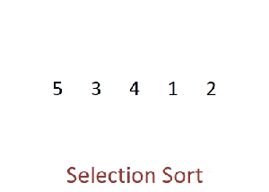

# 选择排序

### 性能分析

插入排序的最好、最坏、平均时间复杂度都是 O(n^2)。

### 适用场景

选择排序的主要优点与数据移动有关。如果某个元素位于正确的最终位置上，则它不会被移动。选择排序每次交换一对元素，它们当中至少有一个将被移到其最终位置上，因此对 n 个元素的表进行排序总共进行至多 n - 1 次交换。在所有的完全依靠交换去移动元素的排序方法中，选择排序属于非常好的一种。

### 特点

- 实现简单
- 不稳定
- 空间复杂度为 O(1)

### 排序过程



首先在未排序序列中找到最小（大）元素，存放到排序序列的起始位置，然后，再从剩余未排序元素中继续寻找最小（大）元素，然后放到已排序序列的末尾。以此类推，直到所有元素均排序完毕。

排序时会将一个数组划分为两部分：已排序、未排序。

1. 将无序区的第一个元素依次跟后面的所有元素进行比较，找到最小的元素。 
2. 将最小元素与第一个元素交换位置。此时无序区的第一位变为有序区。
3. 再从无序区选择第一个元素，重复 1、2 步骤，直到所有无序区元素只剩一个。

```swift
func selectionSort(_ array: [Int]) -> [Int] {
    guard array.count > 1 else { return array }
    
    var newArray = array
    
    for i in 0..<newArray.count - 1 {
        
        var minIndex = i
        
        for j in i + 1 ..< newArray.count {
            if newArray[minIndex] > newArray[j] {
                minIndex = j
            }
        }
        
        if i != minIndex {
            newArray.swapAt(minIndex, i)
        }
    }
    
    return newArray
}
```

### 泛化

```swift
func selectionSort<T>(_ array: [T], _ isOrderBefore: (T, T) -> Bool) -> [T] {
    guard array.count > 1 else { return array }
    
    var newArray = array
    
    for i in 0..<newArray.count - 1 { // 1
        
        var minIndex = i
        
        for j in i + 1 ..< newArray.count {
            if isOrderBefore(newArray[j], newArray[minIndex]) {
                minIndex = j
            }
        }
        
        if i != minIndex { // 2
            newArray.swapAt(minIndex, i)
        }
    }
    
    return newArray
}
```

参考链接：

- [维基百科：选择排序](https://zh.wikipedia.org/wiki/%E9%80%89%E6%8B%A9%E6%8E%92%E5%BA%8F)
- [十大经典排序算法（动图演示）](https://www.cnblogs.com/onepixel/p/7674659.html)


