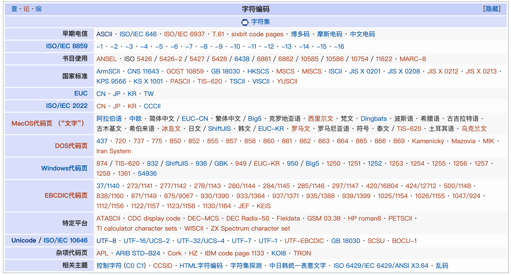

# 编码

## 1. 字符编码

是把**字符集**中的字符**编码**为指定集合中某一对象，以便文本在计算机中存储和通过通信网络的传递。常见的例子包括将拉丁字母表编码成摩斯电码和ASCII。其中，ASCII将字母、数字和其它符号编号，并用7比特的二进制来表示这个整数。

按照惯例，人们认为字符集和字符编码是同义词，因为使用同样的标准来定义提供什么字符并且这些字符如何编码到一系列的代码单元。

常见字符编码标准如下：

### 1.1 Unicode

中文名万国码、国际码、统一码、单一码。是计算机科学领域里的一项业界标准。它对世界上大部分的文字系统进行了整理、编码，使得电脑可以用更为简单的方式来呈现和处理文字。

#### Unicode转换格式
Unicode 的实现方式称为 Unicode转换格式（Unicode Transformation Format，简称为 UTF）

- **UTF-8** 是一种变长编码，它将基本 7 位 ASCII 字符仍用 7 位编码表示，占用一个字节（首位补 0）。而遇到与其他 Unicode 字符混合的情况，将按一定算法转换，每个字符使用 1-3 个字节编码，并利用首位为 0 或 1 进行识别。这样对以7位ASCII字符为主的西文文档就大幅节省了编码长度。
- **UTF-16** 由于每个字符占用了两个字节，而不同系统平台使用不同的字节顺序（又称端序或尾序Endianness）规则， 所以使用UTF-16亦有两种通用标准。
	- **UTF-16 BE** （大端序） Windows 支持
	- **UTF-16 LE** （小端序） Mac 支持
- UTF7/UTF32/...... 

> 当前通用的实现方式是 UTF-16 小端序（LE）、UTF-16 大端序（BE）和 UTF-8。

