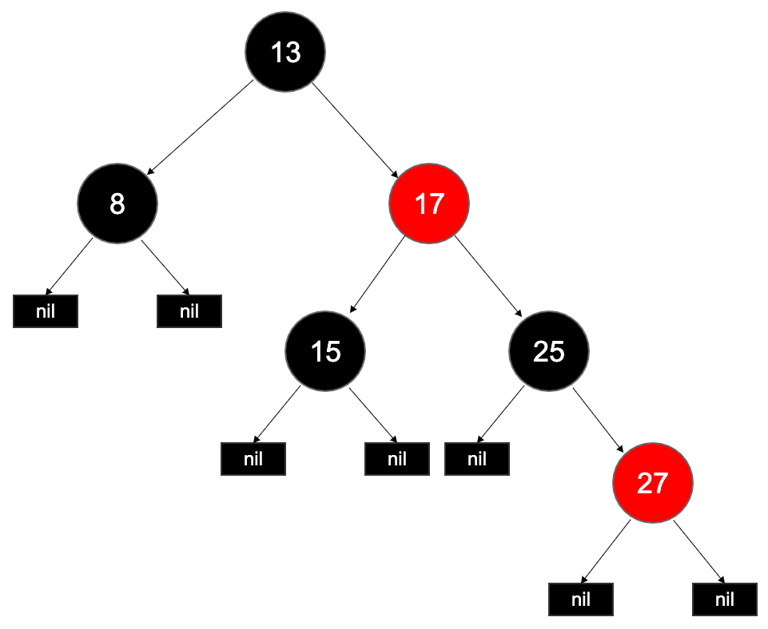

# 红黑树

红黑树是一种**自平衡二叉查找树**。红黑树的结构复杂，但查找、插入和删除的操作有有着良好的最坏时间复杂度：O(log n)。

### 为什么需要红黑树

二叉搜索树（BST）在极端情况下会退化成近似链表的数据结构，查找时间复杂度退化成 O(n)。

基于这个原因，AVL 树被提出，在插入和删除之后通过对树的一部分节点进行旋转操作，让左子树和右子树的高度差总是不大于 1。但是这个要求过于严格，导致每次进行插入/删除节点的时候，几乎都需要执行旋转。特别是在需要频繁进行插入/删除操作时，会使性能大打折扣。

红黑树就是为了解决这个问题而产生的，相较于 AVL 树，它牺牲了部分平衡性以换取插入/删除操作时少量的旋转操作，整体来说性能要优于AVL树。

### 性质

红黑树的每个节点都带有颜色属性，红色或者黑色，它具有以下 5 个性质：

1. 节点是红色或黑色。
2. 根是黑色。
3. 所有叶子都是黑色（叶子是NIL节点）。
4. 每个红色节点必须有两个黑色的子节点。（从每个叶子到根的所有路径上不能有两个连续的红色节点。）
5. 从任一节点到其每个叶子的所有简单路径都包含相同数目的黑色节点。

下面是一个具体的红黑树图例：

接下来，我们根据上面的性质做一些推断：

根据 `性质 5` ，根节点到每个叶子的所有路径都包含相同数量的黑色节点，那么其**最短可能路径就是只由黑色节点组成的路径**。

结合 `性质 4` ，最长路径就是在最短路径基础上，插入最多数量的红色节点：从根节点开始给每个黑色节点都添加一个红色节点。因此，**最长可能路径是最短可能路径的两倍长度**。

如下图：

所以，我们得出如下结论：

**从根到叶子的最长可能路径不多于最短可能路径的两倍长。**

基于这个结论，这个树大致上是平衡的。因为操作比如插入、删除和查找某个值的最坏情况时间都要求与树的高度成比例，这个在高度上的理论上限允许红黑树在最坏情况下都是高效的。

参考链接：

- [维基百科：红黑树](https://zh.wikipedia.org/wiki/%E7%BA%A2%E9%BB%91%E6%A0%91)