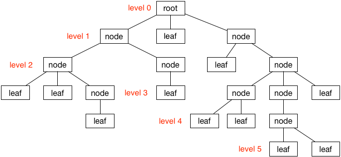

# 树

树（Tree）是一种类似于树状的数据结构，它描述了对象间的层次关系。通过下面这张图我们可以对树有一个直观的认识：



从图中可以看到，一棵树是由根（root）、节点（node）和叶子（leaf）构成。

节点是树的基本构成元素。第 0 层节点是根节点，它可以被看做是树的入口。末端节点称为叶子。

下面我们来实现一种最基础、没有任何限制的树。

```swift
class Node {
  var value: String
  var children: [Node] = []
  weak var parent: Node?

  init(value: String) {
    self.value = value
  }

  func add(child: Node) {
    children.append(child)
    child.parent = self
  }
}
```
然后通过它构建这样一棵树：


```swift
let blackTea = Node(value: "black")
let greenTea = Node(value: "green")
let chaiTea = Node(value: "chai")

let soda = Node(value: "soda")
let milk = Node(value: "milk")

let gingerAle = Node(value: "ginger ale")
let bitterLemon = Node(value: "bitter lemon")

beverages.add(child: hotBeverage)
beverages.add(child: coldBeverage)

hotBeverage.add(child: tea)
hotBeverage.add(child: coffee)
hotBeverage.add(child: cocoa)

coldBeverage.add(child: soda)
coldBeverage.add(child: milk)

tea.add(child: blackTea)
tea.add(child: greenTea)
tea.add(child: chaiTea)

soda.add(child: gingerAle)
soda.add(child: bitterLemon)
```

接下来，我们将对这棵树进行一些探索。

**打印**

如果没有控制台输出，很难对一棵树的内部构造进行验证。因此，在创建了一棵树之后，最好将它在控制台打印出来。

```swift
print(beverages)
```

为了能让控制器按照要求打印出树的结构，我们需要让 `Node` 实现 `CustomStringConvertible` 协议：

```swift
extension Node: CustomStringConvertible {
  var description: String {
    var text = "\(value)"
    if !children.isEmpty {
      text += " {" + children.map { $0.description }.joined(separator: ", ") + "} "
    }
    return text
  }
}
```
这样我们让节点以递归的方式将其本身和它的孩子节点、孩子的孩子节点等归属于它的所有节点组合打印:

```swift
"beverages {hot {tea {black, green, chai} , coffee, cocoa} , cold {soda {ginger ale, bitter lemon} , milk} } \n"
```

**搜索**

假如我们需要知道一棵树中是否包含特定的值，那么我们需要给让其节点实现搜索方法：

```swift
extension Node {
  func search(value: String) -> Node? {
    if value == self.value {
      return self
    }
    for child in children {
      if let found = child.search(value: value) {
        return found
      }
    }
    return nil
  }
}
```

**泛化**

之前定义的节点只支持储存 `String` 类型的值，现在，我们将其泛化以支持更多的类型。由于 Swift 对泛型的支持，很容易实现：

```swift
class Node<T> {

  var value: T
  weak var parent: Node?
  var children: [Node] = []
  
  init(value: T) {
    self.value = value
  }
  
  func add(child: Node) {
    children.append(child)
    child.parent = self
  }
}
```

同时也需要对搜索函数也支持泛型：

```swift
extension Node where T: Equatable {

  func search(value: T) -> Node? {
    if value == self.value {
      return self
    }
    for child in children {
      if let found = child.search(value: value) {
        return found
      }
    }
    return nil
  }
}
```

参考链接：

- [Swift Algorithm Club: Swift Tree Data Structure](https://www.raywenderlich.com/1053-swift-algorithm-club-swift-tree-data-structure)