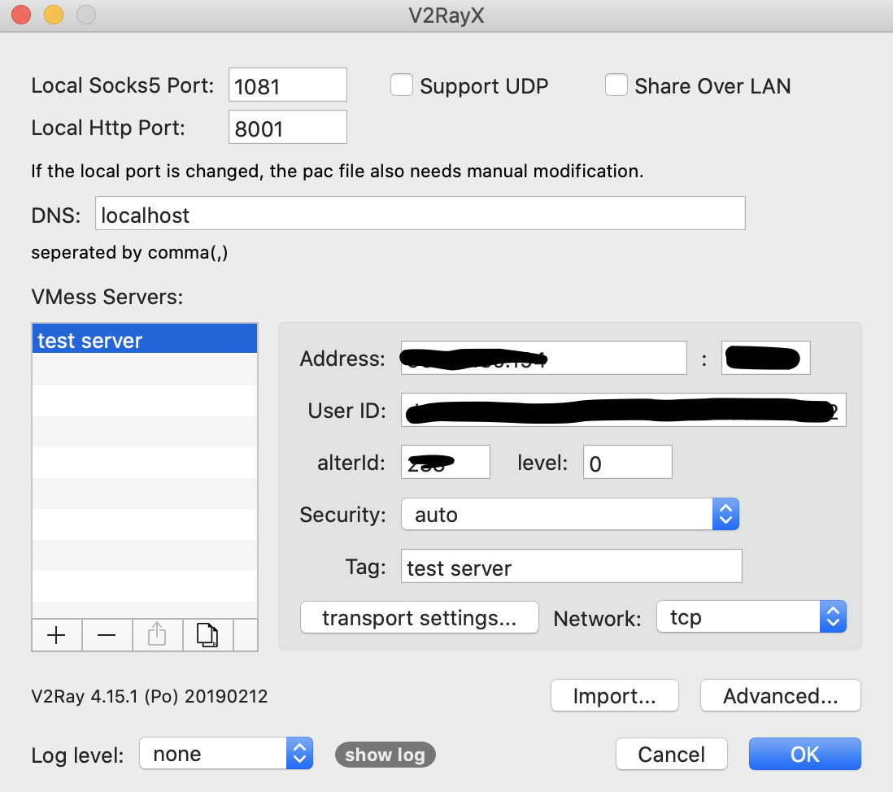

# VPS + V2Ray

进行三个部分的操作： VPS、V2Ray、客户端。

### 1. VPS

> Virtual Private Servers（虚拟主机）

**购买**

目前相对稳定的 VPS 服务商是搬瓦工 [https://bandwagonhost.com/](https://bandwagonhost.com/)（需要科学上网）

购买完成之后在 _ClientArea - Services - MyServices_ 可以看到买到的虚拟主机。

点击 **KiwiVM Control Panel** 进入虚拟机配置界面。

**安装系统**

选择 _Install new OS_ ，安装 `debian-9-x86_64` 系统。

安装完成之后返回 _Main controls_ 保存以下信息：

```
---------- VPS 配置信息 -------------

Public IP address = x.x.x.x
SSH Port = xxx
用户名 = xxx （默认 root）
密码 = xxx
```

> 如果密码没有记下来可以选择左侧 _Root password modification_ 重新生成

### 2. V2Ray

**远程登录vps**

命令行运行 ssh 指令：

```shell
ssh -p {端口号} {用户名}@{IP 地址}`
```

**同步北京时间**

删除系统自带的时间配置

```shell
rm -rf /etc/localtime
```

配置时间

```shell
ln -s /usr/share/zoneinfo/Asia/Shanghai /etc/localtime
```

**安装 v2ray**

先安装 curl 

```shell
apt-get update -y && apt-get install curl -y
```

使用 [V2Ray 一键安装脚本](https://github.com/233boy/v2ray)安装 v2ray

```
bash <(curl -s -L https://git.io/v2ray.sh)
```
安装选项可以直接使用默认。

安装完成之后将 _V2Ray 配置信息_ 保存:

```
---------- V2Ray 配置信息 -------------

 地址 (Address) = x.x.x.x

 端口 (Port) = xxx

 用户ID (User ID / UUID) = xxx-xxx-xxx-xxx

 额外ID (Alter Id) = xxx

 传输协议 (Network) = xxx

 伪装类型 (header type) = xxx
```

### 3. 客户端

**macOS**

安装客户端：

[https://github.com/Cenmrev/V2RayX](https://github.com/Cenmrev/V2RayX)

配置代理：

选择状态栏 - V2RayClient - Configure 打开配置窗口。

将 v2ray 代理节点信息填入右侧对应位置:



v2ray 提供了 PAC、Global、Manual 三种模式，一般使用 PAC 模式，只在需要的请求使用代理。我们可以对 _pac.js_ 文件进行编辑，添加需要使用代理访问的域名。

最后，点击 _Load Core_ ，状态栏图标变黑色表示加载成功。

**iOS**

需要在 App Store 美区商店购买：Quantumult 或者 Shadowrocket 软件。

添加代理配置 - Vmess 模式 - 填写节点参数 - 保存


**Windows**

[https://github.com/2dust/v2rayN](https://github.com/2dust/v2rayN)

**Android**

[https://github.com/2dust/v2rayNG](https://github.com/2dust/v2rayNG)

教程地址：

[https://www.youtube.com/watch?v=rPTzORHg5lQ](https://www.youtube.com/watch?v=rPTzORHg5lQ)