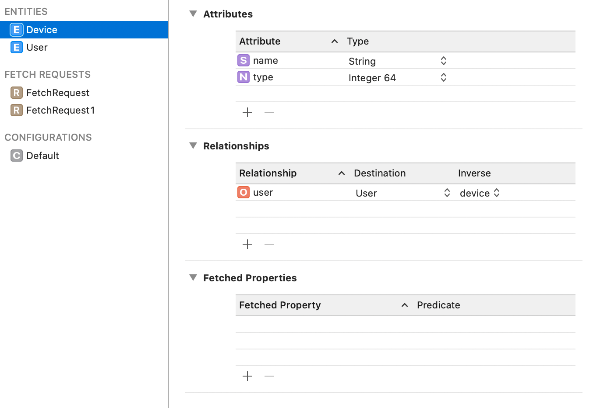

# 多个 store

### 为什么用到多个 store

- 比如有一些敏感信息不希望被缓存在硬盘文件中时，可以选择使用 `NSInMemoryStoreType` 
- 不同的实体对于储存需求不同，比如有的需要储存为只读文件，有的需要储存为 SQLite，而另一些需要储存为二进制文件等。

### 如何使用多个 store

显然，我们可以通过 NSPersistentStoreDescription 创建多个 store 交给 coordinator 来管理。 

但是如何才能让实体储存在不同的 store 中呢？

如下图，我们可以在 example.xcdatamodeld 编辑器的左侧看到 ENTITIES, FETCH REQUESTS, CONFIGURATIONS  三个选项。其中的 CONFIGURATIOS 标签栏就是用来做这件事情的。



Editor -> Add Configuration 添加一个新的 Configuration。将 Entities 拖拽到新的 Configuration 中。

在 store 的初始化方法（或者 StoreDescription 的属性）中，我们可以为其提供一个 configurationName：

```swift
let store = NSPersistentStore(persistentStoreCoordinator: NSPersistentStoreCoordinator?, configurationName: String?, at: URL, options: [AnyHashable : Any]?)

let storeDescription = NSPersistentStoreDescription()
storeDescription.configurationName = "SomeConfiguration"
```

在 coordinator 加载这个 store 时，会为其匹配对应的 Configuration，数据操作也会作用于相应的的 store。

### 不同 store 中的实体关系

CoreData 并**不支持**不同 store 中的实体间的关系。

如果必须要这样做，那么需要使用 `fetched properties` 来实现。
