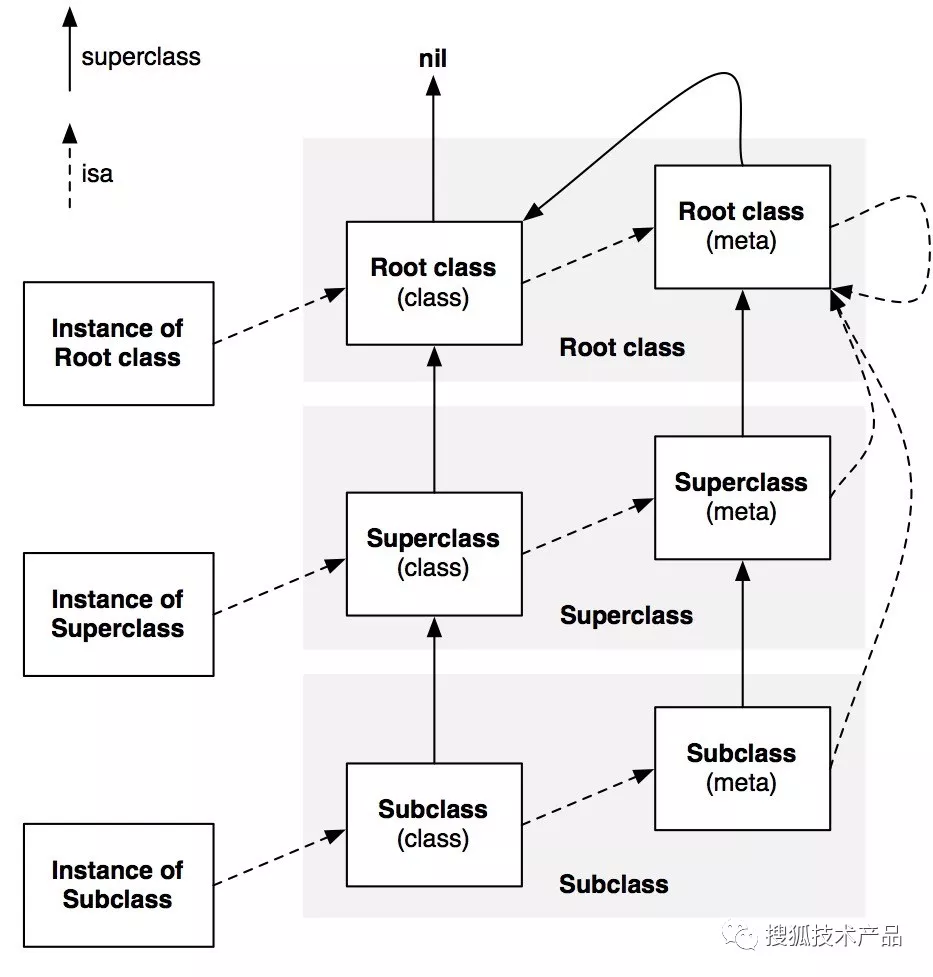

# Runtime

Runtime 是一套API，它提供了在程序运行时动态地对**对象**、**方法**进行创建和修改的途径。

> OC语言是一门动态语言，运行时通过消息机制去执行方法。这就为 Runtime 的实现提供了基础。

## 1. 基本概念

### 1.1 Instance、Class、MetaClass

**Instance**


```c
/// Represents an instance of a class.
struct objc_object {
    Class _Nonnull isa  OBJC_ISA_AVAILABILITY;
};
```

实例对象使我们对类对象进行初始化的时候创建的。在这个过程中会拷贝实例所属的类的成员变量，但并不拷贝类定义的方法。调用实例方法时，系统会根据实例的 `isa` 指针去类的方法列表及父类的方法列表中寻找与消息对应的 `selector` 指向的方法。

**Class**

```c
/// An opaque type that represents an Objective-C class.
typedef struct objc_class *Class;

struct objc_class {
    Class _Nonnull isa  OBJC_ISA_AVAILABILITY;

#if !__OBJC2__
    Class _Nullable super_class                              OBJC2_UNAVAILABLE;
    const char * _Nonnull name                               OBJC2_UNAVAILABLE;
    long version                                             OBJC2_UNAVAILABLE;
    long info                                                OBJC2_UNAVAILABLE;
    long instance_size                                       OBJC2_UNAVAILABLE;
    struct objc_ivar_list * _Nullable ivars                  OBJC2_UNAVAILABLE;
    struct objc_method_list * _Nullable * _Nullable methodLists                    OBJC2_UNAVAILABLE;
    struct objc_cache * _Nonnull cache                       OBJC2_UNAVAILABLE;
    struct objc_protocol_list * _Nullable protocols          OBJC2_UNAVAILABLE;
#endif

} OBJC2_UNAVAILABLE;
/* Use `Class` instead of `struct objc_class *` */
```

类对象(Class)是由程序员定义并在运行时由编译器创建的，它没有自己的实例变量，这里需要注意的是类的成员变量和实例方法列表是属于实例对象的，但其存储于类对象当中的。

- `isa` 指针是和 `Class` 同类型的 `objc_class` 结构指针，指向其所属的类，即元类。元类中存储着类对象的类方法，当访问某个类的类方法时会通过该 `isa` 指针从元类中寻找方法对应的函数指针。
- `super_class` 指针指向该类所继承的父类对象，如果该类已经是最顶层的根类(如`NSObject或NSProxy`), 则 `super_class`为`NULL`。
- `cache` 用于缓存最近使用的方法。在我们每次调用过一个方法后，这个方法就会被缓存到 `cache` 列表中，下次调用的时候 `runtime` 就会优先去 `cache` 中查找，如果没有，才去 `methodLists` 中查找方法，以提高执行效率。
- `version` 提供了类的版本信息。这对于对象的序列化非常有用，它可以让我们识别出不同类定义版本中实例变量布局的改变。
- `protocols` 存放了该类遵循的协议列表

**MetaClass**

元类(Metaclass)就是类对象的类，其中存放了类对象的类方法。元类，就像之前的类一样，它也是一个对象，也可以调用它的方法。所以这就意味着它必须也有一个类。所有的元类都使用根元类作为他们的类。比如所有`NSObject`的子类的元类都会以`NSObject`的元类作为他们的类。所有的元类的`isa`指针都指向根元类。

下面图中表示了对象间 isa的关系，以及类的继承关系:



### 1.2 SEL、IMP、Method


实例对象中存放 `isa` 指针以及实例变量，有 `isa` 指针可以找到实例对象所属的类对象，类中存放着实例方法列表，在这个方法列表中 `SEL` 作为 `key`，`IMP` 作为 `value`。 在编译时期，根据方法名字会生成一个唯一的 `Int` 标识，这个标识就是 `SEL`。`IMP` 其实就是函数指针，指向了最终的函数实现。整个 `Runtime` 的核心就是 `objc_msgSend` 函数，通过给类发送 `SEL` 以传递消息，找到匹配的 `IMP` 再获取最终的实现。

**Method**

```c
typedef struct objc_method *Method;

struct objc_method {
    SEL method_name                                          OBJC2_UNAVAILABLE;
    char *method_types                                       OBJC2_UNAVAILABLE;
    IMP method_imp                                           OBJC2_UNAVAILABLE;
} 
```

- `method_name` 类型为 SEL
- `method_imp` 类型为 IMP
- `method_types` 是个 char 指针，存储方法的参数类型和返回值类型

Method = SEL + IMP + method_types，相当于在 `SEL` 和 `IMP` 之间建立了一个**映射**。

**SEL**

```c
typedef struct objc_selector *SEL;
```

SEL可以理解为**方法名**。
> TODO

**IMP**

```c
/// A pointer to the function of a method implementation. 
#if !OBJC_OLD_DISPATCH_PROTOTYPES
typedef void (*IMP)(void /* id, SEL, ... */ ); 
#else
typedef id (*IMP)(id, SEL, ...); 
#endif
```
实际上就是一个**函数指针**，指向方法实现的首地址。通过取得 `IMP`，我们可以跳过 `runtime` 的消息传递机制，直接执行 `IMP` 指向的函数实现，这样省去了 `runtime` 消息传递过程中所做的一系列查找操作，会比直接向对象发送消息高效一些，当然必须说明的是，这种方式只适用于极特殊的优化场景，如效率敏感的场景下大量循环的调用某方法。

### 1.3 属性和成员变量

**成员变量**

```c
/// An opaque type that represents an instance variable.
typedef struct objc_ivar *Ivar;

struct objc_ivar {
    char *ivar_name                                          OBJC2_UNAVAILABLE;
    char *ivar_type                                          OBJC2_UNAVAILABLE;
    int ivar_offset                                          OBJC2_UNAVAILABLE;
#ifdef __LP64__
    int space                                                OBJC2_UNAVAILABLE;
#endif
} 
```

`Ivar` 实例变量类型，是一个指向 `objc_ivar` 结构体的指针，它保存了：

- `ivar_name` 变量名
- `ivar_type` 变量类型
- `ivar_offset` 基地址偏移字节

**属性**

```c
/// An opaque type that represents an Objective-C declared property.
typedef struct objc_property *objc_property_t;
```

属性是添加了存取方法的成员变量。我们每定义一个 `@property` 都会添加对应的 `ivar`, `getter`和`setter`到类结构体`objc_class`中。具体来说，系统会在objc_ivar_list中添加一个成员变量的描述，然后在methodLists中分别添加setter和getter方法的描述。

> @property = ivar + getter + setter;

## 2. Runtime API

### 2.1 对象的操作

**查询**

```swift
// 指定类名，获取类对象
func objc_getClass(_ name: UnsafePointer<Int8>) -> Any!
// 指定类名，获取元类对象
func objc_getMetaClass(_ name: UnsafePointer<Int8>) -> Any!
// 指定协议名，获取协议对象
func objc_getProtocol(_ name: UnsafePointer<Int8>) -> Protocol?

// 获取程序中已注册的类
func objc_copyClassList(_ outCount: UnsafeMutablePointer<UInt32>?) -> AutoreleasingUnsafeMutablePointer<AnyClass>?
// 获取程序中已注册的协议
func objc_copyProtocolList(_ outCount: UnsafeMutablePointer<UInt32>?) -> AutoreleasingUnsafeMutablePointer<Protocol>?
// 获取程序中所有依赖的名称
func objc_copyImageNames(_ outCount: UnsafeMutablePointer<UInt32>?) -> UnsafeMutablePointer<UnsafePointer<Int8>>
// 获取程序中指定依赖中的所有类名
func objc_copyClassNamesForImage(_ image: UnsafePointer<Int8>, _ outCount: UnsafeMutablePointer<UInt32>?) -> UnsafeMutablePointer<UnsafePointer<Int8>>?
```
**创建**

```swift
// 创建一个协议
func objc_allocateProtocol(_ name: UnsafePointer<Int8>) -> Protocol?
// 注册一个协议
func objc_registerProtocol(_ proto: Protocol)

// 创建一个类及其元类
func objc_allocateClassPair(_ superclass: AnyClass?, _ name: UnsafePointer<Int8>, _ extraBytes: Int) -> AnyClass?
// 注册指定类及其元类
func objc_registerClassPair(_ cls: AnyClass)
// 销毁一个通过 objc_allocateClassPair 创建的类及其元类
func objc_disposeClassPair(_ cls: AnyClass)
```
> 当创建一个类的时候，首先调用 `objc_allocateClassPair`方法去创建，然后设置类的一些列属性，比如： `class_addMethod` 和 `class_addIvar`。设置完之后调用注册方法 `objc_registerClassPair`，此时，这个类就可以被使用了。
> 
> 调用 `objc_disposeClassPair` 之前，请确保这个类的**实例**和**子类**已经被销毁。

### 2.2 类的操作

**查询**

```swift
// 获取类的名称
func class_getName(_ cls: AnyClass?) -> UnsafePointer<Int8>
// 获取类的版本
func class_getVersion(_ cls: AnyClass?) -> Int32
// 指定名称获取属性
func class_getProperty(_ cls: AnyClass?, _ name: UnsafePointer<Int8>) -> objc_property_t?
// 获取类所在的依赖名字
func class_getProperty(_ cls: AnyClass?, _ name: UnsafePointer<Int8>) -> objc_property_t?
// 获取父类
func class_getSuperclass(_ cls: AnyClass?) -> AnyClass?
// 指定名称，获取成员变量
func class_getClassVariable(_ cls: AnyClass?, _ name: UnsafePointer<Int8>) -> Ivar?
// 指定名称，获取类方法
func class_getClassMethod(_ cls: AnyClass?, _ name: Selector) -> Method?
// 指定名称获取函数的实现 IMP
func class_getMethodImplementation(_ cls: AnyClass?, _ name: Selector) -> IMP?
func class_getMethodImplementation_stret(_ cls: AnyClass?, _ name: Selector) -> IMP?

// 获取变量列表
func class_copyIvarList(_ cls: AnyClass?, _ outCount: UnsafeMutablePointer<UInt32>?) -> UnsafeMutablePointer<Ivar>?
// 获取属性列表
func class_copyPropertyList(_ cls: AnyClass?, _ outCount: UnsafeMutablePointer<UInt32>?) -> UnsafeMutablePointer<objc_property_t>?
// 获取方法列表
func class_copyMethodList(_ cls: AnyClass?, _ outCount: UnsafeMutablePointer<UInt32>?) -> UnsafeMutablePointer<Method>?
// 获取协议列表
func class_copyProtocolList(_ cls: AnyClass?, _ outCount: UnsafeMutablePointer<UInt32>?) -> AutoreleasingUnsafeMutablePointer<Protocol>?
```
**添加**

```swift
// 添加成员变量
func class_addIvar(_ cls: AnyClass?, _ name: UnsafePointer<Int8>, _ size: Int, _ alignment: UInt8, _ types: UnsafePointer<Int8>?) -> Bool
// 添加属性
func class_addProperty(_ cls: AnyClass?, _ name: UnsafePointer<Int8>, _ attributes: UnsafePointer<objc_property_attribute_t>?, _ attributeCount: UInt32) -> Bool
// 添加方法
func class_addMethod(_ cls: AnyClass?, _ name: Selector, _ imp: IMP, _ types: UnsafePointer<Int8>?) -> Bool
// 添加协议
func class_addProtocol(_ cls: AnyClass?, _ protocol: Protocol) -> Bool
```

**修改**

```swift
// 修改类的版本
func class_setVersion(_ cls: AnyClass?, _ version: Int32)
// 替换方法
func class_replaceMethod(_ cls: AnyClass?, _ name: Selector, _ imp: IMP, _ types: UnsafePointer<Int8>?) -> IMP?
```

### 2.3 方法的操作

**查询**

```swift
// 获取参数名
func method_getName(_ m: Method) -> Selector
// 获取参数和返回值的类型
func method_getTypeEncoding(_ m: Method) -> UnsafePointer<Int8>?
// 获取方法的实现
func method_getImplementation(_ m: Method) -> IMP
// 获取参数数量
func method_getNumberOfArguments(_ m: Method) -> UInt32

// 获取函数中指定索引的参数类型
func method_copyArgumentType(_ m: Method, _ index: UInt32) -> UnsafeMutablePointer<Int8>?
// 获取函数返回类型
func method_copyReturnType(_ m: Method) -> UnsafeMutablePointer<Int8>
```

**修改**

```swift
// 交换两个方法的实现
func method_exchangeImplementations(_ m1: Method, _ m2: Method)
```
```Object-C
// This is an atomic version of the following:
IMP imp1 = method_getImplementation(m1);
IMP imp2 = method_getImplementation(m2);
method_setImplementation(m1, imp2);
method_setImplementation(m2, imp1);
```

### 2.4 变量的操作

```swift
// 获取变量名称
func ivar_getName(_ v: Ivar) -> UnsafePointer<Int8>?
// 获取变量类型
func ivar_getTypeEncoding(_ v: Ivar) -> UnsafePointer<Int8>?
// 获取变量相对于初始地址的内存偏移量
func ivar_getOffset(_ v: Ivar) -> Int
```

### 2.5 NSObject 中的运行时接口

- `class` 方法返回对象的类
- `isKindOfClass` 和 `isMemberOfClass` 方法检查对象是否存在于指定的类的继承体系中(是否是其子类或者父类或者当前类的成员变量)
- `respondsToSelector`: 检查对象能否响应指定的消息
- `conformsToProtocol`:检查对象是否实现了指定协议类的方法
- `methodForSelector`: 返回指定方法实现的地址

## 3. 应用场景


### 3.1 MethodSwizzling

这项技术主要基于以下几个接口来实现：

```swift
func class_replaceMethod(_ cls: AnyClass?, _ name: Selector, _ imp: IMP, _ types: UnsafePointer<Int8>?) -> IMP?
func method_exchangeImplementations(_ m1: Method, _ m2: Method)
```

实现过程：

```Object-C
static dispatch_once_t onceToken;
    dispatch_once(&onceToken, ^{
        //case1: 替换实例方法
        Class selfClass = [self class];
        //case2: 替换类方法
        Class selfClass = object_getClass([self class]);
        
        //源方法的SEL和Method
        SEL oriSEL = @selector(viewWillAppear:);
        Method oriMethod = class_getInstanceMethod(selfClass, oriSEL);
        
        //交换方法的SEL和Method
        SEL cusSEL = @selector(customViewWillApper:);
        Method cusMethod = class_getInstanceMethod(selfClass, cusSEL);
        
        //先尝试給源方法添加实现，这里是为了避免源方法没有实现的情况
        BOOL addSucc = class_addMethod(selfClass, oriSEL, method_getImplementation(cusMethod), method_getTypeEncoding(cusMethod));
        if (addSucc) {
            //添加成功：将源方法的实现替换到交换方法的实现
            class_replaceMethod(selfClass, cusSEL, method_getImplementation(oriMethod), method_getTypeEncoding(oriMethod));
        }else {
            //添加失败：说明源方法已经有实现，直接将两个方法的实现交换即可
            method_exchangeImplementations(oriMethod, cusMethod);
        }
    });
```

#### 3.1.1 Hook

在开发中，经常用到系统提供的API，但出于某些需求，我们可能会对某些方法的实现不太满意，就想去修改它以达到更好的效果，Hook由此诞生。iOS开发会使用Method Swizzling来达到这样的效果：当特定的消息发出时，会先到达我们提前预置的消息处理函数，取得控制权来加工消息以及后续处理。

案例一：

项目需要更换所有图标，新的图片资源比旧图片多了一个前缀“new_”。对于所有使用 `imageNamed:` 加载的图片可以使用如下方案实现替换：

```Object-C
// 給全局图片名称添加前缀
@implementation UIImage (Hook)

+ (void)load {
    
    static dispatch_once_t onceToken;
    dispatch_once(&onceToken, ^{
        
        Class selfClass = object_getClass([self class]);
        
        SEL oriSEL = @selector(imageNamed:);
        Method oriMethod = class_getInstanceMethod(selfClass, oriSEL);
        
        SEL cusSEL = @selector(myImageNamed:);
        Method cusMethod = class_getInstanceMethod(selfClass, cusSEL);
        
        BOOL addSucc = class_addMethod(selfClass, oriSEL, method_getImplementation(cusMethod), method_getTypeEncoding(cusMethod));
        if (addSucc) {
            class_replaceMethod(selfClass, cusSEL, method_getImplementation(oriMethod), method_getTypeEncoding(oriMethod));
        }else {
            method_exchangeImplementations(oriMethod, cusMethod);
        }
        
    });
}

+ (UIImage *)myImageNamed:(NSString *)name {

    NSString * newName = [NSString stringWithFormat:@"%@%@", @"new_", name];
    return [self myImageNamed:newName];
}

@end
```

#### 3.1.2 AOP面向切面编程

利用AOP可以对业务逻辑的各个部分进行隔离，从而使得业务逻辑各部分之间的耦合度降低，提高程序的可重用性，同时提高了开发的效率。

案例：

需要跟踪记录APP中按钮的点击次数和频率等数据：

```Object-C
@implementation UIButton (Hook)

+ (void)load {
    
    static dispatch_once_t onceToken;
    dispatch_once(&onceToken, ^{
        
        Class selfClass = [self class];
        
        SEL oriSEL = @selector(sendAction:to:forEvent:);
        Method oriMethod = class_getInstanceMethod(selfClass, oriSEL);
        
        SEL cusSEL = @selector(mySendAction:to:forEvent:);
        Method cusMethod = class_getInstanceMethod(selfClass, cusSEL);
        
        BOOL addSucc = class_addMethod(selfClass, oriSEL, method_getImplementation(cusMethod), method_getTypeEncoding(cusMethod));
        if (addSucc) {
            class_replaceMethod(selfClass, cusSEL, method_getImplementation(oriMethod), method_getTypeEncoding(oriMethod));
        }else {
            method_exchangeImplementations(oriMethod, cusMethod);
        }
        
    });
}

- (void)mySendAction:(SEL)action to:(id)target forEvent:(UIEvent *)event {
    [CountTool addClickCount];
    [self mySendAction:action to:target forEvent:event];
}

@end
```

> MethodSwizzling的封装
> 
> ```Object-C
> + (void)swizzleMethods:(Class)class originalSelector:(SEL)origSel swizzledSelector:(SEL)swizSel {
> 
> 	Method origMethod = class_getInstanceMethod(class, origSel);
> 	Method swizMethod = class_getInstanceMethod(class, swizSel);
> 
> 	BOOL didAddMethod = class_addMethod(class, origSel,
> 	method_getImplementation(swizMethod),
> 	method_getTypeEncoding(swizMethod));
> 
> 	if (didAddMethod) {
> 		class_replaceMethod(class, swizSel, method_getImplementation(origMethod), method_getTypeEncoding(origMethod));
> 	} else {
> 		method_exchangeImplementations(origMethod, swizMethod);
> 	}
> }
```

### 3.2 字典转模型

遍历模型中的所有属性，根据模型的属性名，去字典中查找对应的 key，取出对应的值，给模型的属性赋值。

```Object-C
/** 字典转模型 **/
+ (instancetype)modelWithDict:(NSDictionary *)dict {
    id objc = [[self alloc] init];
    unsigned int count = 0;
    // 获取成员属性数组
    Ivar *ivarList = class_copyIvarList(self, &count);
    // 遍历所有的成员属性名
    for (int i = 0; i < count; i ++) {
        // 获取成员属性
        Ivar ivar = ivarList[i];
        // 获取成员属性名
        NSString *ivarName = [NSString stringWithUTF8String:ivar_getName(ivar)];
        NSString *key = [ivarName substringFromIndex:1];
        // 从字典中取出对应 value 给模型属性赋值
        id value = dict[key];
        // 获取成员属性类型
        NSString *ivarType = [NSString stringWithUTF8String:ivar_getTypeEncoding(ivar)];
        // 判断 value 是不是字典
        if ([value isKindOfClass:[NSDictionary class]]) {
            ivarType = [ivarType stringByReplacingOccurrencesOfString:@"@" withString:@""];
            ivarType = [ivarType stringByReplacingOccurrencesOfString:@"\"" withString:@""];
            Class modalClass = NSClassFromString(ivarType);
            // 字典转模型
            if (modalClass) {
                // 字典转模型
                value = [modalClass modelWithDict:value];
            }
        }
        if ([value isKindOfClass:[NSArray class]]) {
            // 判断对应类有没有实现字典数组转模型数组的协议
            if ([self respondsToSelector:@selector(arrayContainModelClass)]) {
                // 转换成id类型，就能调用任何对象的方法
                id idSelf = self;
                // 获取数组中字典对应的模型
                NSString *type = [idSelf arrayContainModelClass][key];
                // 生成模型
                Class classModel = NSClassFromString(type);
                NSMutableArray *arrM = [NSMutableArray array];
                // 遍历字典数组，生成模型数组
                for (NSDictionary *dict in value) {
                    // 字典转模型
                    id model =  [classModel modelWithDict:dict];
                    [arrM addObject:model];
                }
                // 把模型数组赋值给value
                value = arrM;
            }
        }
        // KVC 字典转模型
        if (value) {
            [objc setValue:value forKey:key];
        }
    }
    return objc;
}
```

### 3.3 归档和解档

当我们使用 NSCoding 进行归档及解档时,  不管模型里面有多少属性, 我们都需要对每一个属性实现一遍 `encodeObject` 和 `decodeObjectForKey` 方法, 这个时候用 `runtime`, 便可以充分体验其好处。

```Object-C
- (void)encodeWithCoder:(NSCoder *)aCoder {
    unsigned int count = 0;
    // 获取类中所有属性
    Ivar *ivars = class_copyIvarList(self.class, &count);
    // 遍历属性
    for (int i = 0; i < count; i ++) {
        // 取出 i 位置对应的属性
        Ivar ivar = ivars[i];
        // 查看属性
        const char *name = ivar_getName(ivar);
        NSString *key = [NSString stringWithUTF8String:name];
        // 利用 KVC 进行取值，根据属性名称获取对应的值
        id value = [self valueForKey:key];
        [aCoder encodeObject:value forKey:key];
    }
    free(ivars);
}

- (instancetype)initWithCoder:(NSCoder *)aDecoder {
    if (self = [super init]) {
        unsigned int count = 0;
        // 获取类中所有属性
        Ivar *ivars = class_copyIvarList(self.class, &count);
        // 遍历属性
        for (int i = 0; i < count; i ++) {
            // 取出 i 位置对应的属性
            Ivar ivar = ivars[i];
            // 查看属性
            const char *name = ivar_getName(ivar);
            NSString *key = [NSString stringWithUTF8String:name];
            // 进行解档取值
            id value = [aDecoder decodeObjectForKey:key];
            // 利用 KVC 对属性赋值
            [self setValue:value forKey:key];
        }
    }
    return self;
}
```

## 4. 方法调用和消息转发

在 OC 中，当一个实例的方法被调用时，会发生如下过程：

- 调用 `objc_msgSend(receiver, selector)` 发送消息
- `receiver` 在其方法缓存中查找该方法，若存在则执行，若不存在继续下面操作
- `receiver` 在其方法列表中查找该方法，若存在则执行，并写入方法缓存。若不存在继续下面操作
- `receiver` 向其父类查找，一直找到根类，若存在则执行，若不存在继续下面操作
- 进入 `class func resolveInstanceMethod(_ sel: Selector!) -> Bool` 

```Object-C
//在这个方法中我们可以利用runtime的特性动态添加方法来处理，具体如下：
void dynamicMethodIMP(id self, SEL _cmd) { 
	// implementation ....
}
+ (BOOL)resolveInstanceMethod:(SEL)sel {
	NSLog(@"sel is %@", NSStringFromSelector(sel));
	if(sel == @selector(setName:)){
		class_addMethod([self class],sel,(IMP)dynamicMethodIMP,"v@:");
		return YES;
	}
	return [super resolveInstanceMethod:sel];
}
```

- 进入 `class func forwardingTarget(for aSelector: Selector!) -> Any?`

```Object-C
// 我们可以在此方法中设置可以处理该方法的代理对象
- (id)forwardingTargetForSelector:(SEL)aSelector
{
    //如果代理对象能处理，则转接给代理对象
    if ([proxyObj respondsToSelector:aSelector]) {
        return proxyObj;
    }
    //不能处理进入转发流程
    return nil;
} 
```

- 如果上述两个时机都无法处理消息，则会进入消息转发流程，其关键方法是：

```Object-C
- (NSMethodSignature *)methodSignatureForSelector:(SEL)aSelector
- (void)forwardInvocation:(NSInvocation *)anInvocation
```
如果 `methodSignatureForSelector` 返回`nil`，则不会继续执行 `forwardInvocation`，转发流程终止，抛出无法处理的异常。

如果 `methodSignatureForSelector` 返回了方法签名，我们还有最后一次机会处理这个消息，那就是在 `forwardInvocation` 回调里，具体可以按照如下的方式使用：

```Object-C
- (NSMethodSignature *)methodSignatureForSelector:(SEL)aSelector
{
    NSMethodSignature *sig = [BBMessageForwardProxy instanceMethodSignatureForSelector:@selector(bb_dealNotRecognizedMessage:)];
    return sig;
}

- (void)forwardInvocation:(NSInvocation *)anInvocation
{
    NSString *debugInfo = [NSString stringWithFormat:@"[debug]unRecognizedMessage:[%@] sent to [%@]",NSStringFromSelector(anInvocation.selector),NSStringFromClass([self class])];
    //重定向方法
    [anInvocation setSelector:@selector(bb_dealNotRecognizedMessage:)];
    //传递调用信息
    [anInvocation setArgument:&debugInfo atIndex:2];
    //BBMessageForwardProxy对象接收转发的消息并打印调用信息
    [anInvocation invokeWithTarget:[BBMessageForwardProxy new]];
}


// BBMessageForwardProxy.h

#import <Foundation/Foundation.h>

@interface BBMessageForwardProxy : NSObject

- (void)bb_dealNotRecognizedMessage:(NSString *)debugInfo;

@end

// BBMessageForwardProxy.m

#import "BBMessageForwardProxy.h"

@implementation BBMessageForwardProxy

- (void)bb_dealNotRecognizedMessage:(NSString *)debugInfo
{
    NSLog(@"%@",debugInfo);
}
```

至此我们在消息转发的最后一个环节里将无法识别的消息转发到了一个 Proxy 类统一打印处理。


参考链接

- [https://github.com/opensource-apple/objc4](https://github.com/opensource-apple/objc4)
- [Objective-C Runtime](https://hit-alibaba.github.io/interview/iOS/ObjC-Basic/Runtime.html)
- [深度揭秘Runtime原理](https://mp.weixin.qq.com/s/BDZoz1zqfduX9kZP0Z0KyA)
- [iOS 开发中 runtime 常用的几种方法](https://mp.weixin.qq.com/s/oKTdrwqk66Z1Y96WnQF_CA)
- [Swift5.0的Runtime机制浅析](https://mp.weixin.qq.com/s/qPlg716RqtiT2PK_WqtBZQ)
- [iOS runtime实战应用：Method Swizzling](https://www.jianshu.com/p/3efc3e94b14c)
- [iOS runtime 之消息转发](https://www.jianshu.com/p/5127ce0628be)