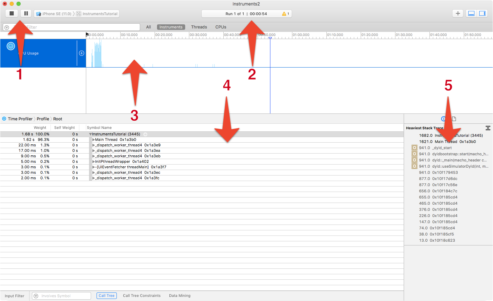
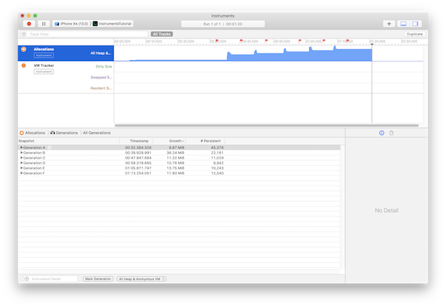
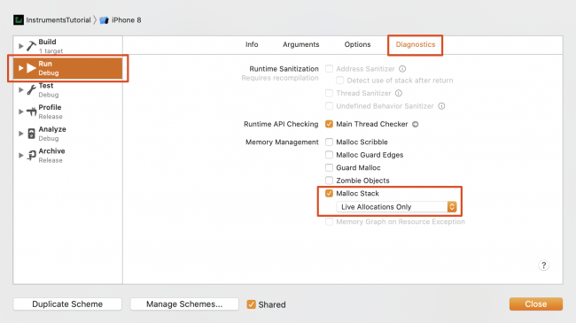
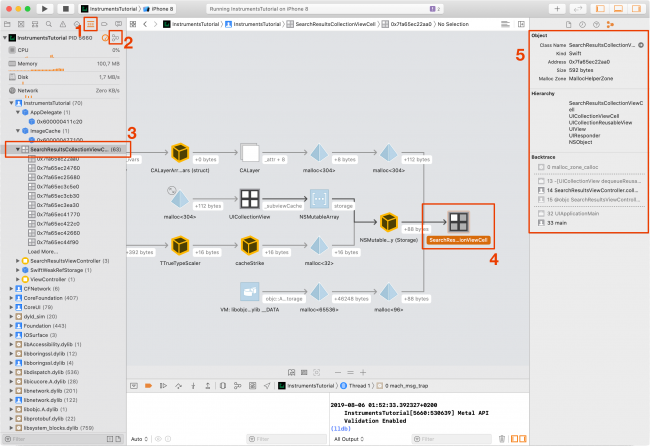

# Instruments

Instruments 是 Apple 提供的一套代码调试工具集。

## Time Profiler

Time Profiler 用来进行性能和耗时分析查找耗时方法。比如进行一个操作之后，程序响应时间长，或者出现卡顿，就可以使用此工具来查找耗时函数。



1. Recording controls: 开始、暂停、停止调试。
2. Run timer: 用来描述调试的时间和次数，比如点击停止再点击开始，次数就会加一。
3. Instrument track: 开销追踪，可以选择一个时间段来查看其详细信息。
4. Detail panel: 显示详细的调试信息，比如函数调用栈、线程、调用时间、耗时等。可以设置 **Call Tree** 来进行信息筛选，双击条目可以跳转到代码，也支持在 xcode 中打开该文件。
5. Inspectors panel: 可以查看指定条目的简明堆栈信息。

## Allocations

Allocations 可以查看程序运行过程中创建的所有**实例**，以及他们**被引用的次数**和占用的**内存**。

内存泄漏分为两种：

1. 程序占用的内存空间不断增长：这种情况下程序最终会耗尽内存空间而被系统结束。
2. 真实的内存泄漏：某个对象没有被其他任何对象引用，却一直存在于内存中。虽然 有 ARC 机制帮助我们进行内存管理，但依然有一些特殊情况会导致这种内存泄漏，比如 循环引用。

### 占用内存持续增加



如图可以通过点击 Detail Panel 底部的 Mark Generation 按钮来标记内存的占用，产生的 GenerationA、GenerationB、GenerationC... 描述了从上一个标记点到当前标记点所增加的内存。

展开标记点选项之后可以查看详细信息。

### 循环引用


调试开始之后可以在 Detail Panel 看到有非常多对象被创建。我们可以在左下角的筛选器中输入项目的名称，筛选出相关对象。比如上图输入了 Instrument 进行筛选。

在筛选结果中 *#Psersistent* 栏表示在当前内存中该对象的实例个数。*#Transient* 栏描述该类型对象在内存中曾经存在过但已经被释放了。

我们要做的就是进行 user-interaction 然后比对条目中对象的 *#Psersistent* 值，看是否被正确释放。比如图中 `SearchResultViewController` 和 `SearchResultsCollectionViewCell ` 存在多个实例，都没有被释放。因此可以判断它们之间可能存在循环引用。

那么接下来的问题就是证实推断并定位循环引用发生的位置。

### Visual Memory Debugger

Xcode8 之后 Apple 提供了 Visual Memory Debugger （可视内存调试）工具。使用它可以对内存泄漏和循环引用进行更进一步的诊断。可以跟 Allocations 配合提高调试效率。

在开始使用 Visual Memory Debugger 之前，需要先打开 Malloc Stack 开关：



从 xcode 中 run 程序并重复之前的 user-interaction，然后打开 Visual Memory Debugger 工具：



图中会标明各个对象的引用关系，以及引用类型（强引用或弱引用）。

在本项目中 `SearchResultsCollectionView` 作为 `SearchResultViewController`   的成员变量会被他强引用，同理，`SearchResultsCollectionViewCell` 也被 `SearchResultViewController ` 强引用。

根据 Visual Memory Debugger 分析可以看到 `SearchResultsCollectionViewCell ` 通过 `heartToggleHandler.context`  的 `swift closure context` 持有对 `SearchResultsViewController ` 的强引用。

这样，我们只要找到 `heartToggleHandler`  并打破循环引用处理就可：

```swift
// before
cell.heartToggleHandler = { isStarred in
  self.collectionView.reloadItems(at: [indexPath])
}

// after
cell.heartToggleHandler = { [weak self] isStarred in
  self?.collectionView.reloadItems(at: [indexPath])
}
```


参考链接：

- [https://www.raywenderlich.com/4784723-instruments-tutorial-getting-started](https://www.raywenderlich.com/4784723-instruments-tutorial-getting-started)