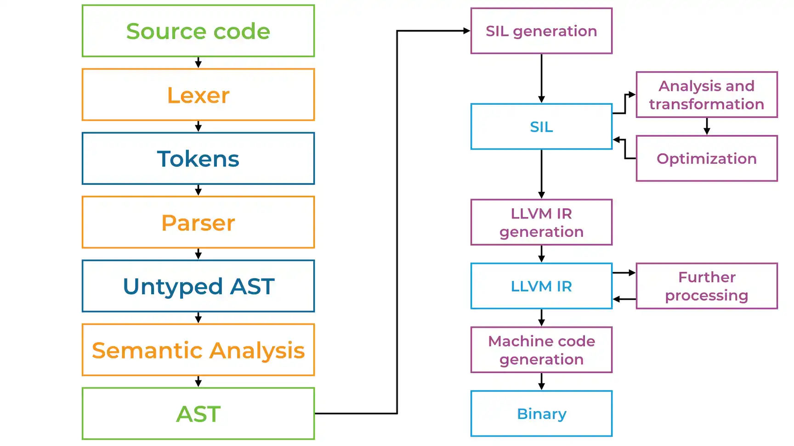

# Swift 编译

## 1 编译&解释

计算机是不能识别高级语言的，所以当我们运行一个高级语言编写的程序时，就需要一个“翻译机” 将源代码翻译为机器码。这个过程分为两类：编译、解释。


### 1.1 编译型语言

编译器把源代码转换为可执行的机器码，程序运行时处理器直接执行机器码。因此，相比于解释性语言来说具有更高的效率。同时也让开发者对硬件（例如内存管理、CPU的使用）具有更强的掌控力。

典型的编译型语言有：C, C++, Erlang, Haskell, Rust, and Go，Swift等。

### 1.2 解释型语言

在程序运行时，解释器会对源代码逐行进行翻译和运行。相较于编译型语言，增加了翻译步骤，所以性能会受到影响。但是得益于 JIT（Just In Time Compilation 即时编译器）的发展，这种差距已经显著的缩小。


典型的解释型语言有： PHP, Ruby, Python, and JavaScript等。


### 1.3 两种类型比较

**执行效率**

编译型语言执行效率高。

解释型语言执行效率低。

**跨平台性**

编译型语言的可执行文件对平台依赖程度高。

解释型语言不依赖操作系统，只要提供了解释环境就可以执行。

**开发便利性**

编译型语言每次代码修改之后都要花费时间进行编译。

解释性语言代码修改之后可以直接执行，不需要等待。

### 1.4 Java

有一些语言兼备编译和解释的特性，比如 Java。

Java 首先由编译器将源代码编译成 _.class_ 类型的文件，然后通过 JVM（Java virtual machine /Java 虚拟机）从 _.class_ 文件中逐行解释执行。JVM 屏蔽了与具体操作系统平台相关的信息，使其具有很好的跨平台性。


## 2 C 语言程序的编译过程

c 语言编写的代码，从源码到可执行的二进制文件需要经过预处理、编译、汇编和链接4个步骤。


### 2.1 预处理 Preprocessing

预处理器会对读取到 `#` 开头的代码（宏、#include等）进行如下操作：

1. 删除注释
2. 展开宏
3. 展开导入的文件

如果在文件中引入了一个头文件，比如 `#include <stdio.h>`，预处理器会去寻找 _stdio.h_ 文件并将其复制到源代码中。

预处理器会将宏展开为相应的代码。

将 `#define` 方法定义的常量替换成实际的值。

可见，在预处理阶段进行的工作，全部都是**文本操作**。

### 2.2 编译 Compilation

将预处理过的文件编译成汇编代码（Assembly code）。

#### 2.2.1 词法分析

词法分析器（Lexical Analyzer/Lexer/Scanner）对源代码进行扫描分割，并生成标记序列（Token）。

Examples of token values

| Token name | Sample token values |
| --- | ---|
| identifier | x color UP |
| keyword | if while return |
| seperator | } { ; |
| operator | + = < |
| literal | true 6.02 "music" |
| comment | /* Retrieves user data */ // must be negative |

对于代码：

```c
x = a + b * 2;
```
词法分析器会生成下面的集合：

```c
[
    (identifier, x), 
    (operator, =), 
    (identifier, a), 
    (operator, +), 
    (identifier, b), 
    (operator, *), 
    (literal, 2), 
    (separator, ;)
]

```

> 词法分析可以看做是我们将一句话切割成很多词汇，并标明词性（名词、动词、介词......）的过程。

#### 2.2.2 语法分析

语法分析器（Parser）根据 _Tokens_ 的类型和值进行语法分析，生成抽象语法树（AST: Abstract Syntax Tree）。

此时的 AST 是缺失一些类型信息的。这是因为对整个源码转换为语法分析树之后我们才有机会对进行类型关系的分析。

#### 2.2.3 语义分析

语义分析也称为类型检查、上下文相关分析，语义分析器（Semantic Analyser）负责检查程序（抽象语法树）中类型之间的关系以及判断他们是否被正确使用。

对 AST 进行调整，完善其中缺失的类型信息。

#### 2.2.4 编译优化 & 代码产生

Optimizing Compiler （优化编译器）在此阶段对代码进行一些列的调整，提高程序执行效率，降低内存占用，降低电量消耗等。

优化编译器可以从各种维度对程序进行优化，包括但不限于：

- 代码优化
	- 循环优化
	- 数据流优化
- 指令优化
- 语言优化
- 平台优化

编译优化是跟汇编代码生成协作完成的。

### 2.3 汇编 Assemble

将 _assembly code_ 转换为二进制的机器码（Object Code/目标代码）。

### 2.4 链接 Linking

将不同模块产生的 _object code_  合并为一个单独的 _object code_ 文件。

假设在源代码中使用了某个库的一个函数，链接器会将我们的代码跟那个库的函数进行链接。

如果这个库是静态链接库，链接器会把源代码中用到的函数复制到源码中。如果是动态链接库，则是将这个库的名字包含在二进制文件中。

## 3 Swift 编译

Swift 的编译是由 Swift 编译器来完成的。

###  3.1 Swift 编译器架构

Swift 主仓库中包含了 Swift 编译器和标准库的源代码、相关组件，如 SourceKit（用于 IDE 集成），以及 Swift 回归测试套件和实现级别的文档。

Swift 驱动库中包含了 Swift 编译器驱动（Driver）的新版实现，目的是替换现有编译器驱动，以增强可扩展性、可维护性以及鲁棒性（Robust）。

整体而言，Swift 编译器的主要职责在于将 Swift 源代码翻译为高效执行的机器码。但是 Swift 编译器的前端同样支持许多其它工具，包括与 IDE 集成的语法高亮、代码补全、以及其它提供便利的工具。

本文对 Swift 编译器的主要组件提供了高阶描述：

**解析（Parsing）**

解析器是一个简易的递归下降解析器（在 lib/Parse 中实现），并带有完整手动编码的词法分析器。

**语义分析（Semantic Analysis）**

语义分析阶段（在 lib/Sema 中实现）负责获取已解析的 AST（抽象语法树）并将其转换为格式正确且类型检查完备的 AST，以及在源代码中提示出现语义问题的警告或错误。语义分析包含类型推断，如果可以成功推导出类型，则表明此时从已经经过类型检查的最终 AST 生成代码是安全的。

**Clang 导入器（Clang Importer）**

Clang 导入器（在 lib/ClangImporter 中实现）负责导入 Clang 模块，并将导出的 C 或 Objective-C API 映射到相应的 Swift API 中。最终导入的 AST 可以被语义分析引用。

**SIL 生成（SIL Generation）**

Swift 中间语言（Swift Intermediate Language，SIL）是一门高级且专用于 Swift 的中间语言，适用于对 Swift 代码的进一步分析和优化。SIL 生成阶段（在 lib/SILGen 中实现）将经过类型检查的 AST 弱化为所谓的「原始」SIL。SIL 的设计在 docs/SIL.rst 有所描述。

**SIL 保证转换（SIL Guaranteed Transformations）**

SIL 保证转换阶段（在 lib/SILOptimizer/Mandatory中实现）负责执行额外且影响程序正确性的数据流诊断（比如使用未初始化的变量）。这些转换的最终结果是「规范」SIL。

**SIL 优化（SIL Optimizations）**

SIL 优化阶段（在 lib/Analysis、lib/ARC、lib/LoopTransforms 以及 lib/Transforms 中实现）负责对程序执行额外的高级且专用于 Swift 的优化，包括（例如）自动引用计数优化、去虚拟化、以及通用的专业化。

**LLVM IR 生成（LLVM IR Generation）**

IR 生成阶段（在 lib/IRGen 中实现）将 SIL 弱化为 LLVM LR，此时 LLVM 可以继续优化并生成机器码。

### 3.2 编译过程

Swift 编译过程与 我们可以参照 c 程序进行理解。

> Swift 是没有预编译这一步的。因为 Swift 里面没有宏的概念。Debug/Release 都是被配置为环境变量实现的。

**词法分析**：

将源码切割成 Tokens。

**语法分析**：

将 Tokens 组织为无类型的 AST。

**语义分析**：

对 无类型 AST 进行类型检查并转换为 完整的 AST。

**生成 SIL**

从 AST 产生 SIL 原始文件。

> SIL 是一种易于进行优化的 Swift 中间语言文件。 [https://github.com/apple/swift/blob/master/docs/SIL.rst](https://github.com/apple/swift/blob/master/docs/SIL.rst)

**SIL 分析和转换和优化**

将 SIL 原始文件进行分析和转换。

对 SIL 进行优化。 [https://github.com/apple/swift/blob/master/docs/HighLevelSILOptimizations.rst](https://github.com/apple/swift/blob/master/docs/HighLevelSILOptimizations.rst)

**生成 LLVM IR**

从 SIL 生成 LLVM IR。

> **Intermediate Representation** 被译为中间表示。编译器不是直接将源语言翻译为目标语言，而是翻译为一种“中间语言”，编译器从业人员称之为“IR”--指令集，之后再由中间语言，利用后端程序和设备翻译为目标平台的汇编语言，不同编译器的中间语言 IR 是不一样的 比如 LLVM IR。
> 
> **LLVM** 是构架编译器的框架系统。LLVM 命名最早源自于底层虚拟机（Low Level Virtual Machine）的缩写,由于命名带来的混乱，目前LLVM就是该项目的全称。LLVM 核心库提供了与编译器相关的支持，可以作为多种语言编译器的后台来使用。能够进行程序语言的编译期优化、链接优化、在线编译优化、代码生成。
> [https://llvm.org/docs/index.html](https://llvm.org/docs/index.html)

**LLVM IR 分析转换和优化**

跟 SIL 类似地，对 LLVM IR 进行分析转换和优化。

**生成机器码**

产生可执行的二进制文件。

至此，Swift 编译器完成了将 Swift 语言的源码转换为 二进制可执文件的整个编译过程。



参考链接：

- [Lexical analysis](https://en.wikipedia.org/wiki/Lexical_analysis)
- [How the Compilation Process Works for C Programs](https://medium.com/datadriveninvestor/compilation-process-db17c3b58e62)
- [Interpreted vs Compiled Programming Languages: What's the Difference?](https://www.freecodecamp.org/news/compiled-versus-interpreted-languages/)
- [A Brief Overview of Swift Compiler](https://medium.com/xcblog/a-brief-overview-of-swift-compiler-7af0bd684718)
- [Swift Compiler](https://swift.org/swift-compiler/#compiler-architecture)
- [[译] Swift 编译器](https://zhuanlan.zhihu.com/p/112465903)
- [How to Build Swift Compiler-Based Tool? The Step-by-Step Guide](https://www.polidea.com/blog/how-to-build-swift-compiler-based-tool-the-step-by-step-guide/)