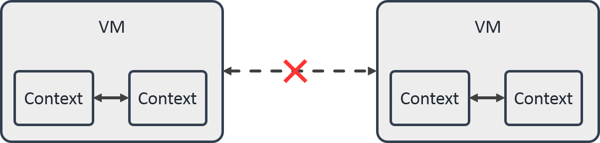

# JavaScriptCore框架分析及应用

## 1. WebKit、JavaScriptCore 和 JavaScriptCore框架

### 1.1 WebKit

WebKit 是 Safari 浏览器的内核。由苹果公司开源，Chrome 浏览器的内核 Blink 也是基于 WebKit 开发的。

其架构如下图:



从图中可以看到，WebKit 就是一个页面渲染以及逻辑处理的引擎。他把接收到的 HTML、JavaScript、CSS 渲染成浏览器页面，并为用户的交互提供支撑。

- **Webkit Embedding API** 是browser UI与webpage进行交互的api接口
- **Platform API** 提供与底层驱动的交互， 如网络， 字体渲染， 影音文件解码， 渲染引擎等。
- **WebCore** 实现了对文档的模型化，包括了CSS, DOM, Render等的实现。
- ** JavaScriptCore** 是专门处理JavaScript脚本的引擎。

### 1.2 JavaScriptCore

JavaScriptCore 是 WebKit 中的重要组成模块。主要负责 JS 脚本的解释和执行。它主要由一下几个部分组成：

- Lexer 词法分析器，将脚本源码分解成一系列的Token，这一过程也叫分词（有的编译器或者解释器把分词叫做 Scanner）。
- Parser 语法分析器，处理Token并生成相应的语法树（AST）
- ByteCodeGenerator，根据 AST 来生成 JSCore 的字节码，完成整个语法解析步骤。
- LLInt 低级解释器，执行 ByteCodeGenerator 生成的二进制代码
- Baseline JIT 基线JIT（just in time 实施编译）
- DFG 低延迟优化的JIT
- FTL 高通量优化的JIT


### 1.3 JavaScriptCore 框架

**JavaScriptCore 框架是由 JavaScriptCore 抽象出来，为 JS 和 Native 间的交互提供支持。**

## 2. JSCore框架中的几个概念

JSContext，JSValue，JSManagedValue，JSExport， JSVirtualMachine

### 1.1 JSContext

JSContext 是 JS 的执行环境。
它提供了以下功能：

- 在 原生代码中执行 JavaScript 脚本
- 获取 JavaScript脚本 中的 对象和值
- 将原生代码中的对象/方法/函数 注册到 JavaScript 执行环境中


```swift
// 初始化一个 JSContext
public init!()

// 从指定 JSVirtualMachine 中初始化一个 JSContext
public init!(virtualMachine: JSVirtualMachine!)

// 执行 JS 代码，并返回代码中最后一个生成的对象
open func evaluateScript(_ script: String!) -> JSValue!

// 执行一段 JS 代码并将 sourceURL 标记为其源 URL （不会改变 JS 代码的执行，常用于debug，或者异常情况上报）
@available(iOS 8.0, *)
open func evaluateScript(_ script: String!, withSourceURL sourceURL: URL!) -> JSValue!
    
// 获取当前执行的JS代码的 上下文对象
open class func current() -> JSContext!

// 获取当前执行的 JS 函数对象
@available(iOS 8.0, *)
open class func currentCallee() -> JSValue!

// 获取当前执行JS代码的 this 对象
open class func currentThis() -> JSValue!

// 获取当前回调的参数
// 这个方法可以用在 Object-C 的Block中，或者 传入JS的回调函数中。
open class func currentArguments() -> [Any]!

// 获取 context 的全局对象。基于 WebKit 的上下文 将返回 WindowProxy 对象的引用
open var globalObject: JSValue! { get }

// 当前上下文中的异常
open var exception: JSValue!

// 上下文的异常处理函数
open var exceptionHandler: ((JSContext?, JSValue?) -> Void)!

// 当前上下文绑定的 JSVirtualMachine
open var virtualMachine: JSVirtualMachine! { get }

// 上下文名字，适用于远程调试
@available(iOS 8.0, *)
open var name: String!
```
应用:

```swift
// 设置异常处理
let context = JSContext()
context?.exceptionHandler = { c, v in
	print("出错了。。。。")
}

// 设置一个数组
let jsVal = context?.evaluateScript("var a = [1, 2, 3]")
//根据名字取出对象
if let v = context?.objectForKeyedSubscript("a") {
	// 可以根据下标取值
	print("a=", v.atIndex(0))
}
```

### 1.2 JSValue

一个 JSValue 实例就是 JSContext 中一个  JS 对象的**引用**（或者叫做指针）。使用它可以完成 JS 和 OC/Swift 间类型的转换，对应关系如 Table1：

**Table1**

| Object-C/Swift | JavaScript |
| --- | --- |
| nil | undefined |
| NSNull | null |
| NSString/String | String |
| NSNumber | Boolean |
| NSDictionary | Object |
| NSArray | Array |
| NSDate | Date |
| Object-C/Swift object | Object |
| NSRange/ CGRect/ CGPoint/ CGSize | Object |

``` swift
// 所在的上下文
open var context: JSContext! { get }

// 在指定上下文中初始化一个值
public /*not inherited*/ init!(object value: Any!, in context: JSContext!)
public /*not inherited*/ init!(bool value: Bool, in context: JSContext!)
public /*not inherited*/ init!(double value: Double, in context: JSContext!)
public /*not inherited*/ init!(int32 value: Int32, in context: JSContext!)
public /*not inherited*/ init!(uInt32 value: UInt32, in context: JSContext!)
// 在指定上下文中初始化一个空的对象/数组
public /*not inherited*/ init!(newObjectIn context: JSContext!)
public /*not inherited*/ init!(newArrayIn context: JSContext!)
// 在指定上下文中初始化一个正则表达式对象
public /*not inherited*/ init!(newRegularExpressionFromPattern pattern: String!, flags: String!, in context: JSContext!)
// 在指定上下文中初始化一个Error对象
public /*not inherited*/ init!(newErrorFromMessage message: String!, in context: JSContext!)
// 在指定上下文中初始化 Promise 对象
@available(iOS 13.0, *)
public /*not inherited*/ init!(newPromiseIn context: JSContext!, fromExecutor callback: ((JSValue?, JSValue?) -> Void)!)
@available(iOS 13.0, *)
public /*not inherited*/ init!(newPromiseResolvedWithResult result: Any!, in context: JSContext!)
@available(iOS 13.0, *)
public /*not inherited*/ init!(newPromiseRejectedWithReason reason: Any!, in context: JSContext!)
// 在指定上下文中初始化一个 Symbol（ES6引入的表示一个唯一的值） 对象
@available(iOS 13.0, *)
public /*not inherited*/ init!(newSymbolFromDescription description: String!, in context: JSContext!)
// 在指定上下文初始化一个 null/undefined 值
public /*not inherited*/ init!(nullIn context: JSContext!)
public /*not inherited*/ init!(undefinedIn context: JSContext!)

// 将 JSValue 转换为原生类型
open func toObject() -> Any!
open func toObjectOf(_ expectedClass: AnyClass!) -> Any!
open func toBool() -> Bool
open func toDouble() -> Double
open func toInt32() -> Int32
open func toUInt32() -> UInt32
open func toNumber() -> NSNumber!
open func toString() -> String!
open func toDate() -> Date!
open func toArray() -> [Any]!
open func toDictionary() -> [AnyHashable : Any]!

// 使用 JS 的 === 操作符进行比较
open func isEqual(to value: Any!) -> Bool
// 使用 JS 的 == 操作符进行比较
open func isEqualWithTypeCoercion(to value: Any!) -> Bool
// 使用 JS 的 instanceof 方法进行比较
open func isInstance(of value: Any!) -> Bool
// 把当前 JSValue 作为函数进行调用
open func call(withArguments arguments: [Any]!) -> JSValue!
// 把当前函数作为构造器进行调用
open func construct(withArguments arguments: [Any]!) -> JSValue!
// 调用对象中的方法
open func invokeMethod(_ method: String!, withArguments arguments: [Any]!) -> JSValue!
```

### 1.3 JSExport

JSExport 是一个协议，通过实现它可以把一个 Native 对象暴漏给js。

实现案例：

```swift
//定义协议，继承自JSExport
//需要添加 @objc
@objc protocol TestProtocol: JSExport {
    
    func testA()
    
    func testB(_ s: String) -> String
    
    func testC(_ o: Any) -> Any

    func testD(_ f: JSValue)//js向swift传递回调函数
}

//实现一个类，实现该协议
//需要添加 @objc,且继承NSObject
@objc class TestDelegate: NSObject, TestProtocol {
    
    func testA() {
        print("testA被调用。。。")
    }
    //注意参数名 _ ，把参数名省略，否则会与js方法对应不上
    func testB(_ s: String) -> String {
        print("testB被调用。。。参数：\(s)")
        return "哈哈哈B"
    }
    
    //传入参数：可以为 JS对象
    //返回值：不可为OC对象，可以为字典
    func testC(_ o: Any) -> Any {
        print("testC被调用。。。参数：\(o)")
        let p =  o as? [String: Any]
        print("p.name", p?["name"])
        return ["pname": "我的名字"]
    }

    //参数： JS函数对象
    func testD(_ f: JSValue) {
        print("testD被调用。。。参数：\(f)")
        var json = [String: Any]()
        json["name"] = "小码"
        json["age"] = 100
        f.call(withArguments: [json])
    }
}


// 调用：
//在代理方法里面设置
func webViewDidFinishLoad(_ webView: UIWebView) {
        //获取网页上下文（固定写法）
        self.context = webView.value(forKeyPath: "documentView.webView.mainFrame.javaScriptContext") as! JSContext
        //创建一个实现协议的对象，js调用的方法将会在里面执行
        let model = TestDelegate()
        //绑定到上下文，设置一个名字，将来js使用这个名字来调用方法
        context.setObject(model, forKeyedSubscript: "WebViewJavascriptBridge" as (NSCopying & NSObjectProtocol)!)
        //出错处理
        context.exceptionHandler = { c, v in
            print("出错了。。。。。。")
        }
        print("加载完成")
}
```

```HTML
<script>
        function btnClickA() {
            WebViewJavascriptBridge.testA();
        }
        function btnClickB() {
            let result =  WebViewJavascriptBridge.testB();
            alert(result)
        }
        function btnClickC(){
            let p = Parent()
            //可向swift中传参（字典，js对象，字符串，int，数组等）
            //可以获取到swift中执行的返回结果（但返回结果不可以为OC的自定义对象，可以为字典等常规对象）
            let result = WebViewJavascriptBridge.testC(p);
            alert(result["pname"])//alert(result.pname)
        }
        function btnClickD(json){
            //可以将JS函数传入，在swift内执行该回调函数（执行时可向内传参）
            WebViewJavascriptBridge.testD(btnClickDCallBack);
        }
        function btnClickDCallBack(){
            alert("btnClickDCallBack")
        }
</script>
```

### 1.4 JSVirtualMachine

一个 JSVirtualMachine 实例就是一个完整独立的 JS 执行环境，并为其提供所需要的底层执行资源。JavaScriptCore API 是线程安全的（例如，我们可以从任何线程创建 JSValue 对象或运行 JS 脚本） 但是，尝试使用相同 JSVirtualMachine 的所有其他线程将被阻塞。 要在多个线程上同时（并发）运行 JavaScript 脚本，需要为每个线程使用单独的 JSVirtualMachine 实例。

主要有两个应用场景：

1. 创建多个 JSVirtualMachine 实现并发的 JavaScript 执行
2. 管理 Object-C/Swift 和 JavaScript 桥接对象的内存。


> 不同的虚拟机之间不能进行传值，每个 JSContext 归属于一个 JSVirtualMachine，一个 JSVM 可以同时持有多个 JSContext。并允许在他们之间进行传值（JSValue）。
> 
> 当初始化一个 未指定JSVirtualMachine 的 JSContext 时，系统会自动创建一个 JSVirtualMachine 并分配给它。


并发案例：

```swift
/*
function1 跟 function2/function3 并发 同时执行
function2 跟 function3 串行 执行顺序不分先后
*/

let vm1 = JSVirtualMachine()
let vm2 = JSVirtualMachine()
let context1 = JSContext(virtualMachine: vm1)
let context2 = JSContext(virtualMachine: vm2)
let context3 = JSContext(virtualMachine: vm2)

let function1: @convention(block) ()->Void = {
    print("function1 start")
    sleep(1)
    print("function1 end")
}
let function2: @convention(block) ()->Void = {
    print("function2 start")
    sleep(1)
    print("function2 end")
}
let function3: @convention(block) ()->Void = {
    print("function3 start")
    sleep(1)
    print("function3 end")
}

context1?.setObject(function1, forKeyedSubscript: "function1" as NSCopying & NSObjectProtocol)
context2?.setObject(function2, forKeyedSubscript: "function2" as NSCopying & NSObjectProtocol)
context3?.setObject(function3, forKeyedSubscript: "function3" as NSCopying & NSObjectProtocol)


DispatchQueue(label: "queue1").async {
    context1?.evaluateScript("function1()")
}
DispatchQueue(label: "queue2").async {
    context2?.evaluateScript("function2()")
}
DispatchQueue(label: "queue3").async {
    context3?.evaluateScript("function3()")
}
```

### 1.5 JSManagedValue

JSValue的封装，用以解决 JavaScript 和 Native 对象之间循环引用的问题。
可以让引用技术和垃圾回收这两种内存管理机制进行正确的转换。

其主要应用场景是：
在 导出为JS对象的 Native 对象中 储存 JavaScript 对象的值。

```swift
// 初始化
public /*not inherited*/ init!(value: JSValue!, andOwner owner: Any!)
public init!(value: JSValue!)

// 获取 JSManagedValue 对应的 JSValue
open var value: JSValue! { get }
```

## 2 应用场景

### 2.1 Native 调用 JS

```swift
let context = JSContext()
context?.exceptionHandler = { context, value in
    if let exception = value?.toString() {
        print("JSError:" + exception)
    }
}
// 在 context 中注册一个 js 函数 add
let jsFuncString = "function add(a, b) { return a + b }"
context?.evaluateScript(jsFuncString)

// 从 context 中取出 add 函数 （JSValue）
let jsAddFunc = context?.objectForKeyedSubscript("add")
// 执行此函数并将返回结果转换为 Int32 类型
let sum = jsAddFunc?.call(withArguments: [1, 2])?.toInt32()
```

### 2.2 JS 调用 Native

#### 2.2.1 方案一： 将 block 闭包注册到 context

案例一： 计算和

```swift
let context = JSContext()
context?.exceptionHandler = { context, value in
    if let exception = value?.toString() {
        print("JSError:" + exception)
    }
}

// 定义一个兼容 block 的闭包
var addClosure: @convention(block) (Int, Int)-> Int = { $0 + $1 }

// 注册到 context
context?.setObject(addClosure, forKeyedSubscript: "add" as NSCopying & NSObjectProtocol)

// 执行函数
let sum = context?.evaluateScript("add(2, 3)")?.toInt32()
```

案例二： 替换 js 的 log 函数

``` swift
let context = JSContext()
context?.exceptionHandler = { context, value in
    if let exception = value?.toString() {
        print("JSError:" + exception)
    }
}
var logClosure: @convention(block) (String) -> Void = { print("JSLog:" + $0) }

let console = context?.objectForKeyedSubscript("console")
console?.setObject(logClosure, forKeyedSubscript: "log")
context?.setObject(console, forKeyedSubscript: "console" as NSCopying & NSObjectProtocol)
context?.evaluateScript("console.log('hello world')")
```

> convention 关键字用来修饰闭包，后面需要跟一个参数：
> 
> - @convention(swift) : 表明这个是一个swift的闭包
> - @convention(block) ：表明这个是一个兼容oc的block的闭包
> - @convention(c) : 表明这个是兼容c的函数指针的闭包。
> 
> ```swift
> class Person:NSObject {
> 	func doAction(action: @convention(swift) (String)->Void, arg:String){
>  		action(arg)
> 	}
> }
> let saySomething_c : @convention(c) (String)->Void = {
> 	print("i said: \($0)")
> }
> let saySomething_oc : @convention(block) (String)->Void = {
> 	print("i said: \($0)")
> }
> let saySomething_swift : @convention(swift) (String)->Void = {
> 	print("i said: \($0)")
> }
> let person = Person()
> person.doAction(action: saySomething_c, arg: "helloworld")
> person.doAction(action: saySomething_oc, arg: "helloworld")
> person.doAction(action: saySomething_swift, arg: "helloworld")
> ```

#### 2.2.2 方案二： 实现 JSExport 协议

详见：**## 1.3 JSExport**  小节

## 3 内存管理

### 3.1 循环引用

不要在 block 里面直接使用 context，或者使用外部的 JSValue 对象

```swift
// 案例一：循环引用，内存泄漏
let context = JSContext()

let function1: @convention(block) ()->Void = {
    context?.evaluateScript("someFunction()")
}
context?.setObject(function1, forKeyedSubscript: "function" as NSCopying & NSObjectProtocol)

// 案例二：循环引用，内存泄漏
let jsValue = JSValue(int32: 0, in: context)

let function2: @convention(block) ()->Void = {
    let _ = jsValue?.toInt32()
}
context?.setObject(function2, forKeyedSubscript: "function" as NSCopying & NSObjectProtocol)
```

正确的方法是在 block 中使用 js 传回的参数

```swift
let function3: @convention(block) (String) -> Void = { message in
    print(message)
}
context?.setObject(function3, forKeyedSubscript: "function" as NSCopying & NSObjectProtocol)
```

参考链接：

- [JavaScriptCore全面解析](https://segmentfault.com/a/1190000017983911)
- [JSCore的基本使用](https://mp.weixin.qq.com/s/7pUB5w0Ivm1yE7KjW2lJiA)
- [深入理解 JSCore](https://www.infoq.cn/article/mXQPTwpqQP7bB0PAN2CF)
- [iOS 中的 JS](https://zhuanlan.zhihu.com/p/34646281)
- [深入剖析 WebKit](http://www.starming.com/2017/10/11/deeply-analyse-webkit/)
- [swift closure 与 oc block 转换](https://www.jianshu.com/p/e495a91c8c96)
- [Swift 中的指针使用](https://onevcat.com/2015/01/swift-pointer/)
- [swift的@convention](https://www.jianshu.com/p/f4dd6397ae86)